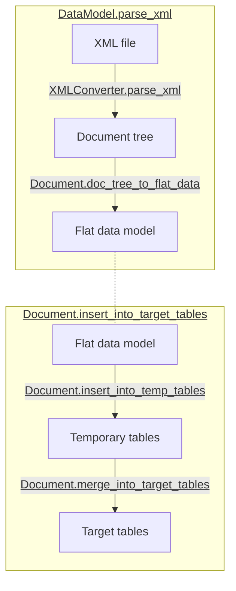
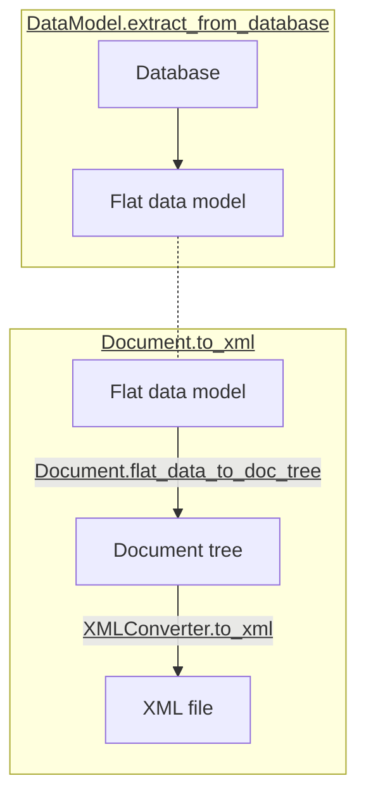

# API Overview

## Building a data model from an XSD file

* [`DataModel`](data_model.md): use directly the constructor to create an instance of a data model. 

!!! Note 
    You should always use the [`DataModel`](data_model.md) constructor to create a new instance instead of trying to change an 
    instance's attributes, as internal objects are created when the constructor is called.

## Inspecting the data model

* [`DataModel.source_tree`](data_model.md): see the data model in tree format before any transformation
* [`DataModel.target_tree`](data_model.md): see the data model in tree format after simplification (corrsponding to the data model
    which will be created in the database)
* [`DataModel.get_entity_rel_diagram`](data_model.md/#xml2db.model.DataModel.get_entity_rel_diagram): get a visual 
    representation of the data model using Mermaid
* [`DataModel.get_all_create_table_statements`](data_model.md/#xml2db.model.DataModel.get_all_create_table_statements):
    get SQLAlchemy `CREATE TABLE` statements that can be printed for detailed inspection

## Loading data into the database

* [`DataModel.parse_xml`](data_model.md/#xml2db.model.DataModel.parse_xml): read and parse a XML document, which is
    loaded in memory
* [`Document.insert_into_target_tables`](document.md/#xml2db.document.Document.insert_into_target_tables): load a file
    into the database

## *Advanced use:* loading data into the database

The flow chart below presents data conversions used to load an XML file into the database, showing the functions used 
for lower level steps. It can be useful for advanced use cases, for instance:

* transforming the data in intermediate steps,
* adding logging,
* limiting concurrent access to the database within a multiprocess setup, etc.

For those scenarios you can easily reimplement 
[`Document.insert_into_target_tables`](document.md/#xml2db.document.Document.insert_into_target_tables) to suit your 
needs, using lower level functions.

## *Advanced use:* get data from the database back to XML

The flow chart below presents data conversions used to get back data from the database into XML, showing the functions 
used for lower level steps.

