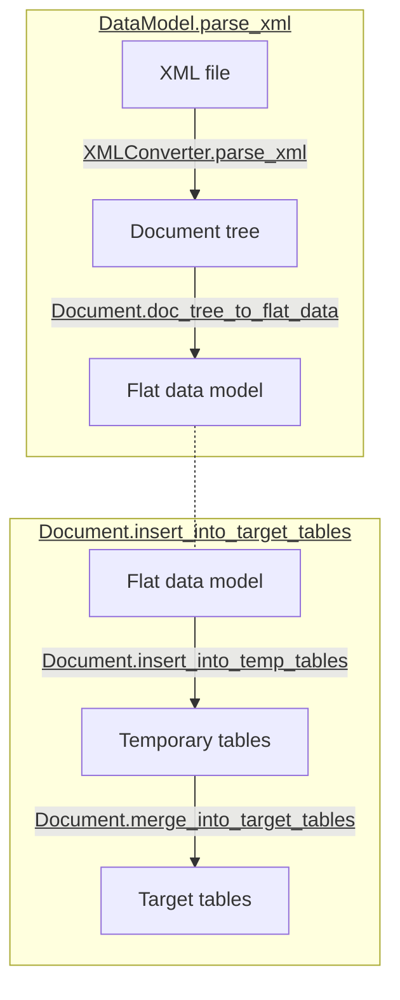
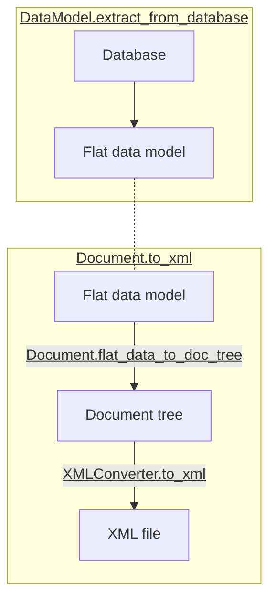

# API Overview

## Building a data model from an XSD file

* [`DataModel`](data_model.md): use directly the constructor to create an instance of a data model. 

!!! Note 
    You should always use the [`DataModel`](data_model.md) constructor to create a new instance instead of trying to change an 
    instance's attributes, as internal objects are created when the constructor is called.

## Inspecting the data model

* [`DataModel.source_tree`](data_model.md): see the data model in tree format before any transformation
* [`DataModel.target_tree`](data_model.md): see the data model in tree format after simplification (corresponding to the data model
    which will be created in the database)
* [`DataModel.get_entity_rel_diagram`](data_model.md/#xml2db.model.DataModel.get_entity_rel_diagram): get a visual 
    representation of the data model using Mermaid
* [`DataModel.get_all_create_table_statements`](data_model.md/#xml2db.model.DataModel.get_all_create_table_statements):
    get SQLAlchemy `CREATE TABLE` statements that can be printed for detailed inspection

## Loading data into the database

* [`DataModel.parse_xml`](data_model.md/#xml2db.model.DataModel.parse_xml): read and parse a XML document, which is
    loaded in memory
* [`Document.insert_into_target_tables`](document.md/#xml2db.document.Document.insert_into_target_tables): load a file
    into the database

## *Advanced use:* loading data into the database

The flow chart below presents data conversions used to load an XML file into the database, showing the functions used 
for lower level steps. It can be useful for advanced use cases, for instance:

* transforming the data in intermediate steps,
* adding logging,
* limiting concurrent access to the database within a multiprocess setup, etc.

For those scenarios you can easily reimplement 
[`Document.insert_into_target_tables`](document.md/#xml2db.document.Document.insert_into_target_tables) to suit your 
needs, using lower level functions.


```mermaid
flowchart TB
    subgraph "<a href='../data_model/#xml2db.model.DataModel.parse_xml' style='color:var(--md-code-fg-color)'>DataModel.parse_xml</a>"
        direction TB
        A[XML file]-- "<a href='../xml_converter/#xml2db.xml_converter.XMLConverter.parse_xml' style='color:var(--md-code-fg-color)'>XMLConverter.parse_xml</a>" -->B[Document tree]
        B-- "<a href='../document/#xml2db.document.Document.doc_tree_to_flat_data' style='color:var(--md-code-fg-color)'>Document.doc_tree_to_flat_data</a>" -->C[Flat data model]
    end
    C -.- D
    subgraph "<a href='../document/#xml2db.document.Document.insert_into_target_tables' style='color:var(--md-code-fg-color)'>Document.insert_into_target_tables</a>"
        direction TB
        D[Flat data model]-- "<a href='../document/#xml2db.document.Document.insert_into_temp_tables' style='color:var(--md-code-fg-color)'>Document.insert_into_temp_tables</a>" -->E[Temporary tables]
        E-- "<a href='../document/#xml2db.document.Document.merge_into_target_tables' style='color:var(--md-code-fg-color)'>Document.merge_into_target_tables</a>" -->F[Target tables]
    end
```

### Multiprocessing example

XML parsing is CPU-bound and scales well across processes. Loading into the
database, however, must be coordinated to avoid conflicts on shared tables.
The right level of synchronisation depends on the backend:

* **DuckDB (file-based)**: only one active writer is allowed at a time, so
  all database I/O must be serialised.
* **PostgreSQL, MS SQL Server, …**: concurrent writes to *different* temp
  tables are safe (each process gets a unique temp-table prefix), but the final
  merge into the shared target tables should be serialised.

The simplest approach (and the one shown below) is to serialise the entire
database phase with a `multiprocessing.Lock`, keeping only the parsing step
parallel. This works correctly for all backends.

```python
import multiprocessing
from xml2db import DataModel


def load_one_file(xml_path, xsd_path, connection_string, lock):
    # Each process creates its own DataModel with a unique temp_prefix.
    model = DataModel(
        xsd_file=xsd_path,
        connection_string=connection_string,
    )
    # XML parsing is CPU-bound and runs in parallel across all processes.
    doc = model.parse_xml(xml_path)

    # Serialise all database I/O across processes.
    with lock:
        doc.insert_into_target_tables()
        model.engine.dispose()


if __name__ == "__main__":
    xsd_path = "schema.xsd"
    connection_string = "duckdb:///data.duckdb"
    xml_files = ["file1.xml", "file2.xml", "file3.xml"]

    lock = multiprocessing.Lock()
    processes = [
        multiprocessing.Process(
            target=load_one_file,
            args=(xml_path, xsd_path, connection_string, lock),
        )
        for xml_path in xml_files
    ]
    for p in processes:
        p.start()
    for p in processes:
        p.join()
        if p.exitcode != 0:
            raise RuntimeError(f"Worker failed with exit code {p.exitcode}")
```

!!! Note
    For backends that support concurrent writers, you can increase throughput
    by splitting
    [`Document.insert_into_target_tables`](document.md/#xml2db.document.Document.insert_into_target_tables)
    into separate calls to
    [`Document.insert_into_temp_tables`](document.md/#xml2db.document.Document.insert_into_temp_tables)
    (run concurrently, since each process has a unique temp-table prefix, so
    there are no collisions) and
    [`Document.merge_into_target_tables`](document.md/#xml2db.document.Document.merge_into_target_tables)
    (serialised via lock).

## *Advanced use:* get data from the database back to XML

The flow chart below presents data conversions used to get back data from the database into XML, showing the functions 
used for lower level steps.


```mermaid
flowchart TB
    subgraph "<a href='../data_model/#xml2db.model.DataModel.extract_from_database' style='color:var(--md-code-fg-color)'>DataModel.extract_from_database</a>"
        direction TB
        A[Database]-->B[Flat data model]    
    end
    B -.- C
    subgraph "<a href='../document/#xml2db.document.Document.to_xml' style='color:var(--md-code-fg-color)'>Document.to_xml</a>" 
        direction TB
        C[Flat data model]-- "<a href='../document/#xml2db.document.Document.flat_data_to_doc_tree' style='color:var(--md-code-fg-color)'>Document.flat_data_to_doc_tree</a>" -->D[Document tree]
        D-- "<a href='../xml_converter/#xml2db.xml_converter.XMLConverter.to_xml' style='color:var(--md-code-fg-color)'>XMLConverter.to_xml</a>" -->E[XML file]
    end
```
