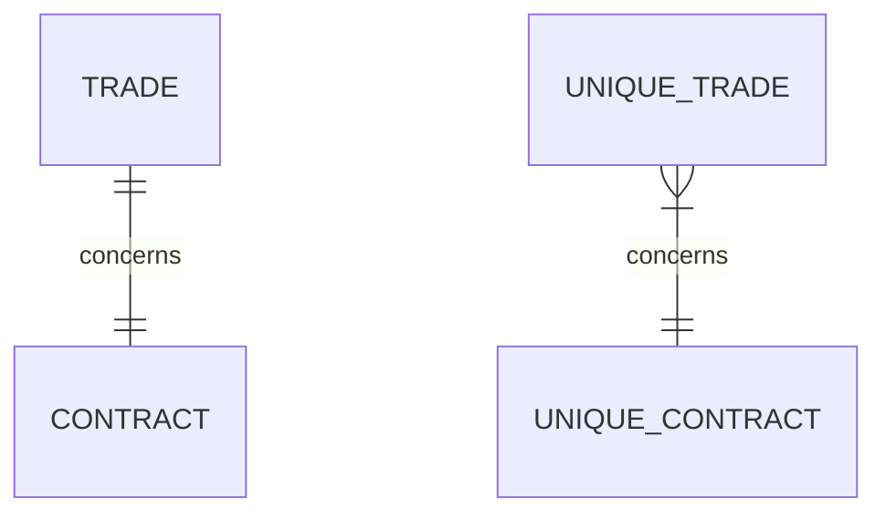
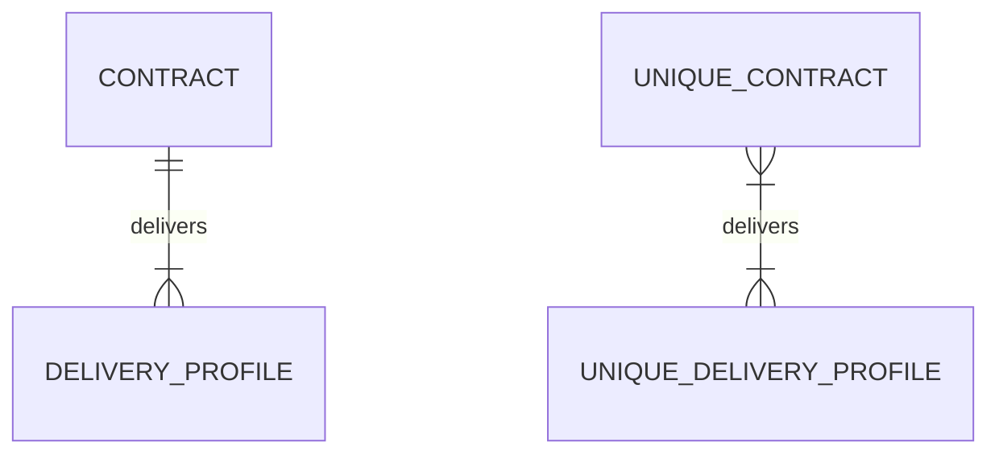
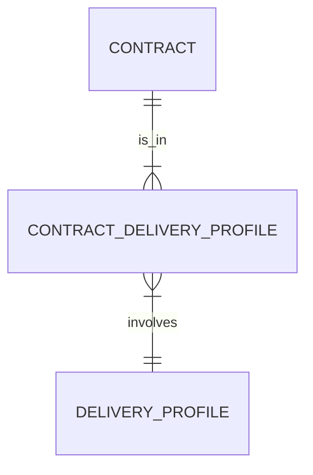

# How it works

This page covers more advanced topics to understand in depth how data models are created and how data is loaded to
the database. This can help with troubleshooting or for advanced use cases.

## Building a data model

A XML document is a tree-like structure where every element is either a simple type (i.e. a scalar value) or a complex
type which has children which can be simple types or complex types. Elements can also have attributes, which are also
scalar values, which `xml2db` will handle just as simple type children. In this page we will call "properties" the 
simple type children of an element or its attributes.

The general idea of `xml2db` is to convert complex types to a database tables, and simple types or XML attributes into 
columns in these tables. When a complex type has complex type children, they are themselves stored in other tables, and 
related to their parents with a foreign key constraint, or a relationship table which holds foreign key constraints to 
both related tables.

The data model created by `xml2db` is mostly bijective with the original XML document, which can in many cases be 
extracted and converted back to a XML document as it was loaded into the database.

!!! note
    XSD specification allows multiple-root schemas. This means that XML documents conforming to this schema can have
    different root elements (XML files will always have just one root element, but they can be different between 
    different XML files conforming to the same schema).
    
    `xml2db` handles this by creating a "virtual" root table, named after the `short_name` provided to the `DataModel`
    constructor, which will act as a root node in all XML files loaded in this data model.

### Hash-based deduplication

By default, `xml2db` tries to reduce storage footprint in the database by storing only once every subtree from the 
original XML document, if it is already present in the database. This deduplication process takes into account the whole
subtree starting from a given element, and not only the direct children of an element.

Taking advantage of the initial tree structure, after parsing the XML document into a python dict, we compute a hash for
each node, which includes all its properties and all its children hash, recursively. Two nodes with the same hash are 
thus identical, so only one of them needs to be stored, even if they appear under different parent nodes.

Hash are stored in the database, with a unique constraint (as a column with binary type named `xml2db_record_hash`). The
primary key of all databases is an auto-incremented integer column, always named `pk_table_name`, `table_name` being the
name of the table.

In some cases, especially when only few  duplicates are expected, it may be more efficient to allow duplicated nodes in 
order to avoid extra tables to store relationships. This can be configured for each table of the data model.

### Modeling relationships

Within a tree, parent-child relationship can have `1-1` or `1-n` cardinality. As we want to reuse child nodes, we
convert these relationships to `n-1` or `n-n`, respectively. Besides, some children are optional. This does not affect
the representation of relationships in any way.

A same child node (same hash) which is used under different parents will have several parents after the "recycling"
process, while it had only one parent (because of the tree structure) in the initial dataset. This example illustrates
a `1-1` relationship converted to `n-1` after reusing nodes:

In that case, `UNIQUE_TRADE` holds a foreign key relationship with `UNIQUE_CONTRACT`, i.e. it has a column named 
`fk_UNIQUE_CONTRACT` which contains the primary key values of related `UNIQUE_CONTRACT` table (named 
`pk_UNIQUE_CONTRACT` in the `UNIQUE_CONTRACT` table).

!!! note
    The form of each end of the links in the entity relationships diagram represent the cardinality of the relationship,
    which can be exactly 1, 0 or 1, 0 or many, 1 or many. You can find the symbols [here](https://mermaid.js.org/syntax/entityRelationshipDiagram.html#relationship-syntax). 

For `1-n` relationships, the same idea applies: a child node can have multiple parents if it was used under different
parent nodes.

In a SQL relational data model, `1-n` relationships can be easily represented with foreign keys. `n-n` relationships 
require  however an additional table holding the relationship, which gives, for the last example with contracts and 
delivery profiles:

!!! note
    By default, these `n-n` relationships which involve a third table to hold the relationship are not explicitly shown
    in the data model visualisation generated by 
    [`DataModel.get_entity_rel_diagram`](api/data_model.md#xml2db.model.DataModel.get_entity_rel_diagram), to favor 
    readability. However, the relationships links on the diagram show an asterisk (*) when a relationship table is 
    involved. These relationship tables are named using the name of the two related tables separated with an underscore.

### Duplicated elements

As explained previously, deduplication can be opted out to avoid the complexity of an intermediary table holding a `n-n`
relationship. In that case, the relationship will stay a `1-n` relationship, which will be modeled with the child 
element holding a foreign key relationship to its parent.

In that case, no hash is stored for the children as there are effectively duplicated elements. The column 
`fk_parent_tablename` in the child table holds the primary keys of associated parent rows in the parent table 
`tablename`.

This choice is made for each table individually, and children of a duplicated element can effectively be themselves 
stored as deduplicated elements.

This means that as the end, there can be both `1-n` and `n-1` relationships involved to represent a tree structure,
which means that the order of dependencies of the resulting tables will not be the same as the original tree structure.
For instance, when we want to make sure to process all dependent tables before processing a table, we won't likely
start with the root table of the tree, as it would be expected without the de-duplication process.

## Caveats

`xml2db` handles a variety of data models, but does not cover all possible schemas allowed by the [XML schema documents
specification](https://en.wikipedia.org/wiki/XML_Schema_(W3C)).

Some known cases which are not supported by `xml2db` are described below. Other cases can fail and may require some
adjustments to work. We recommend thorough testing for more "exotic" schemas; for instance it is possible to implement
"round-trip" tests from sample XML files to database and back to XML, and compare the resulting XML file with the 
original one.

### Recursive XSD

Recursive XML schemas are not supported, because most of the time they will result in cycles in foreign key constraints
dependencies, which we cannot handle easily.

### Mixed content elements

XML elements with mixed content can contain both text and children elements (tags). `xml2db` offers partial support for
this: the text value will be stored in a specific column named `value`, but it will not record the specific sequence of
text and children elements within a node. When using 
[`Document.to_xml`](api/document.md#xml2db.document.Document.to_xml), text value will always appear before children 
elements.

## Loading process

This section gives more detailed explanations on how parsing and loading data work. The integration of an XML file can 
be decomposed in lower level steps described below.

### Parsing a XML document

First, we load all the XML document in memory using `lxml` and extract the data as a nested `dict`, where each node
keeps a reference of its type, and store its data content. This task is achieved by the function 
[`XMLConverter.parse_xml`](api/xml_converter.md#xml2db.xml_converter.XMLConverter.parse_xml).

This limits the size of files that can be loaded, due to memory limitations. The merging database transaction also 
limits the size of the files that can be loaded, depending on the server performance. On the other hand, handling data
in memory makes the processing way simpler and faster. We handle files with a size around 500 MB without any issue.

### Computing hashes

We compute tree hashes (`sha-1`) recursively by adding to each node's hash the hashes of its children element, be it 
simple types, attributes or complex types. Children are processed in the specific order they appeared in the XSD schema, 
so that hashing is really deterministic.

Right after this step, a hook function is called if provided in the configuration (top-level `document_tree_hook` option
in the configuration `dict`), which gives direct access to the underlying tree data structure just before it is 
extracted to be loaded to the database. This can be used, for instance, to prune or modify some parts of the document 
tree.

### Extracting data

We extract data from the tree structure based on the type (table name) they belong to, walking the data tree down.
Doing so, we create temporary incremental primary keys for each row and perform deduplication when it is needed, using 
the hashes previously computed. We store relationship as they will be stored in the database, using the temporary 
primary key of the other table related rows in a foreign key column.

At this stage, we have a data representation that matches the one we will find in the database, except that it contains 
only the data from the XML file we just parsed, and the final primary keys and foreign keys won't be the same.

### Loading the data

The data we converted is then loaded to the database in a separate set of tables, which have the same names that the 
target tables, but prefixed with `temp_XXX` (with `XXX` being a random 8 characters `uuid` string, by default).

We keep the primary keys from the flat data model created at the previous stage, as temporary keys.

!!! tip
    The `temp_prefix` argument can be passed to the constructor of `DataModel` to use a specific prefix instead of the 
    random one, which can be useful if you want to decompose the process of loading data and merging it with the target
    tables later, for instance to gain a finer control over concurrency.

### Merging the data

The last step is to merge the temporary tables data into the target tables, while enforcing deduplication, keeping 
relationships, etc.

This is done by issuing a sequence of `update` and `insert` SQL statements using `sqlalchemy`, in a single transaction.
The process boils down to:

* inserting missing records into the target tables, 
* getting back the auto-incremented primary keys into the temporary tables,
* updating relationship to use target primary keys instead of temporary primary keys,
* continue with the next table.

### Summing up

The whole loading process can be achieved by the high level functions 
[`DataModel.parse_xml`](api/data_model.md#xml2db.model.DataModel.parse_xml) and 
[`Document.insert_into_target_tables`](api/document.md#xml2db.document.Document.insert_into_target_tables). However, 
the later can be decomposed in lower level function calls, for instance if you want to separate the loading to the 
temporary tables and the merge operation into the target tables. You can have a look at 
[`Document.insert_into_target_tables`](api/document.md#xml2db.document.Document.insert_into_target_tables) 
source code to see how the lower level steps are stitched together.

## Extracting the data back to XML

Extracting the data from the database and converting it back to XML follow similar steps, in reverse order.

### Querying data from the database

Walking through the data model tree, we query all tables using a chain of joins to the root table, on which we apply the
where clause provided to the function 
[`DataModel.extract_from_database`](api/data_model.md#xml2db.model.DataModel.extract_from_database). Results are stored 
in a [`Document`](api/document.md#xml2db.document.Document) instance in flat tables, with their primary keys and foreign
keys taken from the database.

### Converting flat data to document tree

Starting from the flat data representation, we build a document tree recursively. This is done by the function 
[`Document.flat_data_to_doc_tree`](api/document.md#xml2db.document.Document.flat_data_to_doc_tree), which performs the 
opposite conversion as [`Document.doc_tree_to_flat_data`](api/document.md#xml2db.document.Document.doc_tree_to_flat_data).

### Building an XML file

From the document tree, we build an XML file using 
[`XMLConverter.to_xml`](api/xml_converter.md#xml2db.xml_converter.XMLConverter.to_xml). This conversion is reversible 
with some caveat, regarding mostly the formatting of numbers and dates.
