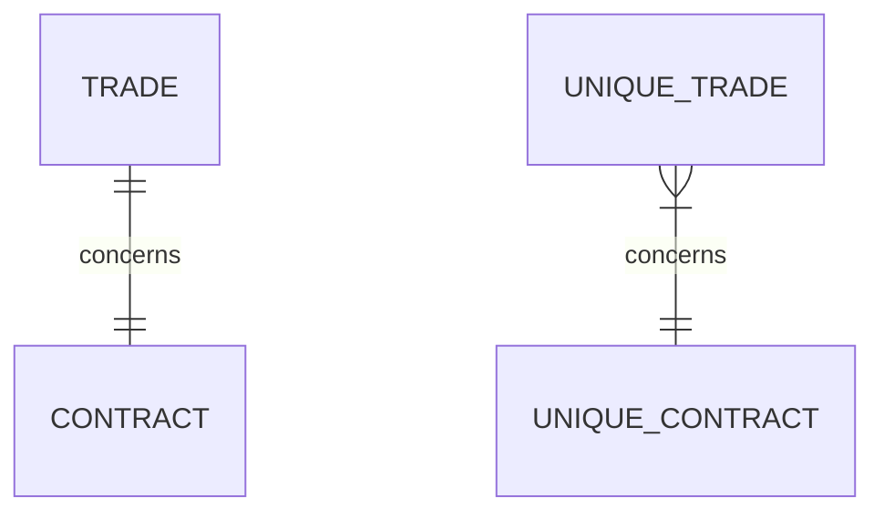
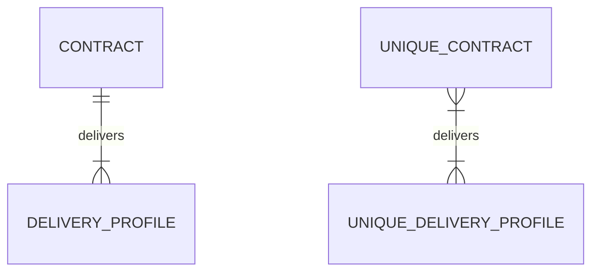
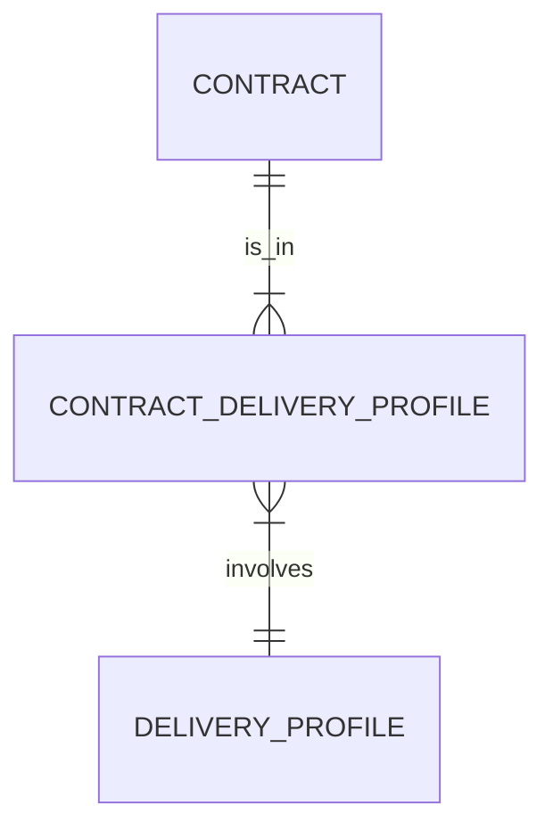

# How it works

This page explains in depth how data models are built and how XML data is loaded — useful for troubleshooting or
advanced use cases.

## Building a data model

An XML document is a tree where every element is either a simple type (a scalar value) or a complex type with children
that are themselves simple or complex types. Attributes are also scalar values and are treated the same as simple type
children. Throughout this page, "properties" refers to the simple type children of an element or its attributes.

`xml2db` converts complex types to database tables and simple types or XML attributes to columns. When a complex type
has complex type children, they are stored in their own tables and linked to their parents via a foreign key or a
join table.

The resulting data model is mostly bijective with the source XML — in most cases, data can be extracted from the
database and converted back to XML.

!!! note
    XSD specification allows multiple-root schemas. This means that XML documents conforming to this schema can have
    different root elements (XML files will always have just one root element, but they can be different between 
    different XML files conforming to the same schema).
    
    `xml2db` handles this by creating a "virtual" root table, named after the `short_name` provided to the `DataModel`
    constructor, which will act as a root node in all XML files loaded in this data model.

### Hash-based deduplication

By default, `xml2db` tries to reduce storage footprint in the database by storing only once every subtree from the 
original XML document, if it is already present in the database. This deduplication process takes into account the whole
subtree starting from a given element, and not only the direct children of an element.

After parsing the XML document into a Python dict, we compute a recursive hash for each node covering all its
properties and children. Two nodes with the same hash are identical, so only one needs to be stored, even if they
appear under different parents.

Hashes are stored in the database, with a unique constraint (as a column with binary type named `xml2db_record_hash`). The
primary key of all databases is an auto-incremented integer column, always named `pk_table_name`, `table_name` being the
name of the table.

In some cases, especially when only a few duplicates are expected, it may be more efficient to allow duplicated nodes in 
order to avoid extra tables to store relationships. This can be configured for each table of the data model.

### Modeling relationships

Within a tree, parent-child relationships have `1-1` or `1-n` cardinality. To allow reuse of child nodes, these
become `n-1` or `n-n` respectively. Optional children are handled the same way.

A child node (identified by its hash) that appears under multiple parents will have several parents after
deduplication — whereas it had only one in the original tree. This example illustrates a `1-1` relationship converted
to `n-1` after reuse:

```mermaid
erDiagram
          TRADE ||--|| CONTRACT : concerns
          UNIQUE_TRADE }|--|| UNIQUE_CONTRACT : concerns
```

In that case, `UNIQUE_TRADE` holds a foreign key relationship with `UNIQUE_CONTRACT`, i.e. it has a column named 
`fk_UNIQUE_CONTRACT` which contains the primary key values of related `UNIQUE_CONTRACT` table (named 
`pk_UNIQUE_CONTRACT` in the `UNIQUE_CONTRACT` table).

!!! note
    The form of each end of the links in the entity relationships diagram represent the cardinality of the relationship,
    which can be exactly 1, 0 or 1, 0 or many, 1 or many. You can find the symbols [here](https://mermaid.js.org/syntax/entityRelationshipDiagram.html#relationship-syntax). 

For `1-n` relationships, the same idea applies: a child node can have multiple parents if it was used under different
parent nodes.

```mermaid
erDiagram
          CONTRACT ||--|{ DELIVERY_PROFILE : delivers
          UNIQUE_CONTRACT }|--|{ UNIQUE_DELIVERY_PROFILE : delivers
```

`1-n` relationships are represented with foreign keys. `n-n` relationships require an additional join table, which
gives, for the last example with contracts and delivery profiles:

```mermaid
erDiagram
          CONTRACT ||--|{ CONTRACT_DELIVERY_PROFILE : is_in
          CONTRACT_DELIVERY_PROFILE }|--|| DELIVERY_PROFILE : involves
```

!!! note
    By default, these `n-n` relationships which involve a third table to hold the relationship are not explicitly shown
    in the data model visualisation generated by 
    [`DataModel.get_entity_rel_diagram`](api/data_model.md#xml2db.model.DataModel.get_entity_rel_diagram), to favor 
    readability. However, the relationships links on the diagram show an asterisk (*) when a relationship table is 
    involved. These relationship tables are named using the name of the two related tables separated with an underscore.

### Duplicated elements

Deduplication can be disabled to avoid the extra join table. The relationship then stays `1-n`, with the child
holding a foreign key to its parent.

In that case, no hash is stored for the children since rows may be duplicated. The column `fk_parent_tablename` in the
child table holds the primary keys of associated rows in the parent table `tablename`.

This choice is made for each table individually, and children of a duplicated element can effectively be themselves 
stored as deduplicated elements.

In the end, the schema can have both `1-n` and `n-1` relationships, so table dependency order differs from the
original tree structure. When processing tables in dependency order, the root table is no longer necessarily first.

## Caveats

`xml2db` handles a variety of data models, but does not cover all possible schemas allowed by the [XML schema documents
specification](https://en.wikipedia.org/wiki/XML_Schema_(W3C)).

Known unsupported cases are described below. Other edge cases may also fail and require adjustments. We recommend
thorough testing for unusual schemas — for example, you can implement round-trip tests (XML → database → XML) and
compare the output against the original.

### Recursive XSD

Recursive XML schemas are not fully supported, because they result in cycles in tables dependencies, which would make
the process much more complex. Whenever a field which would introduce a dependency cycle is detected in the XSD, it is 
discarded with a warning, which means that the corresponding data in XML files will not be imported. The rest of the
data should be processed correctly.

### Mixed content elements

XML elements with mixed content can contain both text and children elements (tags). `xml2db` offers partial support for
this: the text value will be stored in a specific column named `value`, but it will not record the specific sequence of
text and children elements within a node. When using 
[`Document.to_xml`](api/document.md#xml2db.document.Document.to_xml), text value will always appear before children 
elements.

## Loading process

This section explains in detail how parsing and loading work. Loading an XML file breaks down into the following steps.

### Parsing an XML document

First, we load the entire XML document into memory using `lxml` and extract the data as a nested `dict`, where each node
keeps a reference of its type and stores its data content. This task is achieved by the function 
[`XMLConverter.parse_xml`](api/xml_converter.md#xml2db.xml_converter.XMLConverter.parse_xml).

This constrains the maximum file size — in-memory parsing has memory limits, and the merge transaction adds a
server-performance constraint. In practice, `xml2db` handles files around 500 MB without issue.

### Computing hashes

Tree hashes are computed recursively by combining each node's hash with the hashes of its children — simple types,
attributes, and complex types alike. Children are processed in the order they appear in the XSD schema, making
hashing fully deterministic.

Right after this step, a hook function is called if provided in the configuration (top-level `document_tree_hook` option
in the configuration `dict`), which gives direct access to the underlying tree data structure just before it is 
extracted to be loaded to the database. This can be used, for instance, to prune or modify some parts of the document 
tree.

### Extracting data

We extract data from the tree structure based on the type (table name) they belong to, walking the data tree down.
Doing so, we create temporary incremental primary keys for each row and perform deduplication when it is needed, using 
the hashes previously computed. We store relationship as they will be stored in the database, using the temporary 
primary key of the other table related rows in a foreign key column.

At this stage, we have a data representation that matches the one we will find in the database, except that it contains 
only the data from the XML file we just parsed, and the final primary keys and foreign keys won't be the same.

### Loading the data

The converted data is loaded into a separate set of tables with the same names as the target tables, but prefixed
with `temp_XXX` (a random 8-character UUID string, by default).

We keep the primary keys from the flat data model created at the previous stage, as temporary keys.

!!! tip
    The `temp_prefix` argument can be passed to the constructor of `DataModel` to use a specific prefix instead of the 
    random one, which can be useful if you want to decompose the process of loading data and merging it with the target
    tables later, for instance to gain a finer control over concurrency.

### Bulk loading

For each supported backend, `xml2db` uses a native bulk-loading mechanism to fill the temporary tables, which is
significantly faster than row-by-row inserts for large datasets. When the native path is unavailable (wrong driver,
missing tool, or server configuration), it falls back silently to SQLAlchemy's standard `executemany`.

| Backend | Mechanism | Required driver / tool | Default threshold |
|---|---|---|---|
| PostgreSQL | `COPY FROM STDIN` | `psycopg2` or `psycopg` | 0 (always used) |
| MySQL / MariaDB | `LOAD DATA LOCAL INFILE` | `pymysql` or `mysqlclient`; server `local_infile=ON` | 100 rows |
| MS SQL Server | `bcp` utility | `bcp` on PATH; SQL or Windows/Kerberos auth | 100 rows |
| DuckDB | `read_csv()` | built-in | 100 rows |

The threshold column means that batches smaller than that number always use `executemany` (avoiding temp-file overhead
for small inserts). PostgreSQL's `COPY` is in-protocol and has no file overhead, so there is no threshold.

For MySQL, when a connection string is passed to `DataModel`, `local_infile=True` is injected automatically into the
connection arguments. The MySQL server must also have `local_infile=ON` (e.g. launched with `--local-infile=1`);
if not, bulk loading is silently skipped.

You can control this behaviour via the `bulk_load` and `bulk_load_threshold` arguments of
[`Document.insert_into_target_tables`](api/document.md#xml2db.document.Document.insert_into_target_tables):

- `bulk_load=None` (default): use the native path when available, fall back to `executemany` silently.
- `bulk_load=False`: always use `executemany`, regardless of what is available.
- `bulk_load=True`: require the native path; raise a `RuntimeError` with an actionable message if the required
  driver, tool, or server setting is missing.

### Merging the data

The last step is to merge the temporary tables data into the target tables, while enforcing deduplication, keeping 
relationships, etc.

This is done by issuing a sequence of `update` and `insert` SQL statements using `sqlalchemy`, in a single transaction
(default) or in multiple transactions.

The process boils down to:

* inserting missing records into the target tables, 
* getting back the auto-incremented primary keys into the temporary tables,
* updating relationship to use target primary keys instead of temporary primary keys,
* continue with the next table.

### Summing up

The full loading process is exposed via
[`DataModel.parse_xml`](api/data_model.md#xml2db.model.DataModel.parse_xml) and
[`Document.insert_into_target_tables`](api/document.md#xml2db.document.Document.insert_into_target_tables). The latter
can be broken down into lower-level calls if you need to separate the temporary-table load from the merge step. See the
[`Document.insert_into_target_tables`](api/document.md#xml2db.document.Document.insert_into_target_tables) source code
for how these steps fit together.

## Extracting the data back to XML

Extracting data from the database and converting it back to XML follows similar steps, in reverse order.

!!! info
    Extraction is currently slow due to complex join queries filtered only at the root level. It is mainly useful
    for round-trip testing and has limited practical value otherwise.

### Querying data from the database

Walking through the data model tree, we query all tables using a chain of joins to the root table, on which we apply the
where clause provided to the function 
[`DataModel.extract_from_database`](api/data_model.md#xml2db.model.DataModel.extract_from_database). Results are stored 
in a [`Document`](api/document.md#xml2db.document.Document) instance in flat tables, with their primary keys and foreign
keys taken from the database.

### Converting flat data to document tree

Starting from the flat data representation, we build a document tree recursively. This is done by the function 
[`Document.flat_data_to_doc_tree`](api/document.md#xml2db.document.Document.flat_data_to_doc_tree), which performs the 
opposite conversion as [`Document.doc_tree_to_flat_data`](api/document.md#xml2db.document.Document.doc_tree_to_flat_data).

### Building an XML file

From the document tree, we build an XML file using 
[`XMLConverter.to_xml`](api/xml_converter.md#xml2db.xml_converter.XMLConverter.to_xml). This conversion is reversible 
with some caveat, regarding mostly the formatting of numbers and dates.
