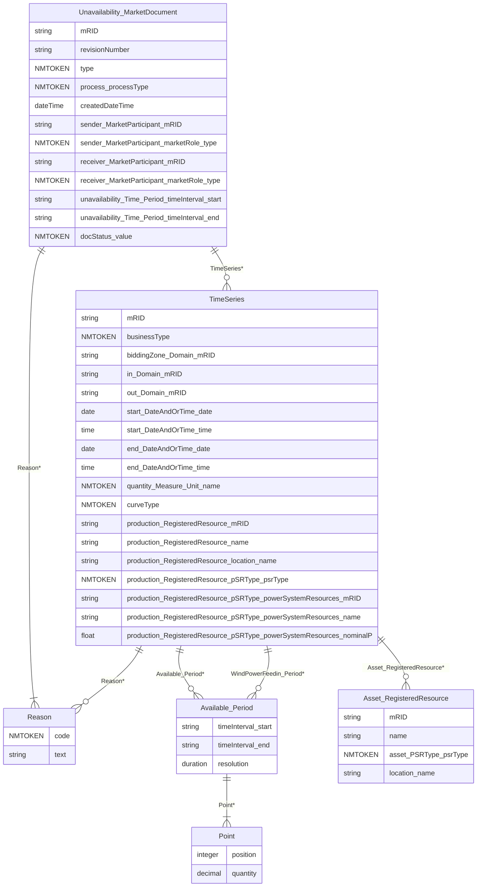

# Loading XML into a relational database

`xml2db` is a Python package that parses and loads XML files into a relational database:

* it automatically maps an XSD schema to a set of tables in the database
* it can handle complex XML files which cannot be denormalized into flat tables
* it works out of the box, without any custom mapping rules.

`xml2db` fits naturally into an ETL or [ELT (Extract, Load, Transform)](https://docs.getdbt.com/terms/elt) pipeline. It loads
XML files into a relational model that stays close to the source data while remaining easy to query as flat database
tables.

## How to get started

After `pip install xml2db`, open the interactive schema explorer to visualize your data model and configure it:

``` bash
xml2db serve path/to/schema.xsd
```

This opens a browser with an ERD, tree views, and DDL for your schema, plus a YAML config editor with autocomplete. Edit the config and the diagram updates live. Save the config to a file when it looks right.

Then import an XML file into the database:

``` bash
xml2db import file.xml schema.xsd \
    --connection-string "postgresql+psycopg2://user:pw@host/db" \
    --config model_config.yml
```

You can also render schema representations without the browser:

``` bash
xml2db render schema.xsd --format erd
xml2db render schema.xsd --format ddl --db-type postgresql
```

See the [Getting started](getting_started.md) guide for full details and the Python API alternative.

The raw data can then be transformed using [DBT](https://www.getdbt.com/), SQL views, or stored procedures to produce
more user-friendly tables.

Built on `sqlalchemy`, `xml2db` supports multiple database backends. Integration tests cover PostgreSQL, MySQL,
MS SQL Server, and DuckDB. You may need to install a connector package (e.g. `psycopg2` or `psycopg` for PostgreSQL,
`pymysql` or `mysqlclient` for MySQL, `pyodbc` for MS SQL Server, or `duckdb-engine` for DuckDB). See
[How it works](how_it_works.md#bulk-loading) for which drivers enable native bulk loading.

## Data model visualization

`xml2db` generates visual diagrams of your data model directly from an XSD file, using
[Mermaid](https://mermaid.js.org/syntax/entityRelationshipDiagram.html) to represent tables and their relationships.

It looks like this:


```mermaid
erDiagram
    Unavailability_MarketDocument ||--o{ TimeSeries : "TimeSeries*"
    Unavailability_MarketDocument ||--|{ Reason : "Reason*"
    Unavailability_MarketDocument {
        string mRID
        string revisionNumber
        NMTOKEN type
        NMTOKEN process_processType
        dateTime createdDateTime
        string sender_MarketParticipant_mRID
        NMTOKEN sender_MarketParticipant_marketRole_type
        string receiver_MarketParticipant_mRID
        NMTOKEN receiver_MarketParticipant_marketRole_type
        string unavailability_Time_Period_timeInterval_start
        string unavailability_Time_Period_timeInterval_end
        NMTOKEN docStatus_value
    }
    TimeSeries ||--o{ Available_Period : "Available_Period*"
    TimeSeries ||--o{ Available_Period : "WindPowerFeedin_Period*"
    TimeSeries ||--o{ Asset_RegisteredResource : "Asset_RegisteredResource*"
    TimeSeries ||--o{ Reason : "Reason*"
    TimeSeries {
        string mRID
        NMTOKEN businessType
        string biddingZone_Domain_mRID
        string in_Domain_mRID
        string out_Domain_mRID
        date start_DateAndOrTime_date
        time start_DateAndOrTime_time
        date end_DateAndOrTime_date
        time end_DateAndOrTime_time
        NMTOKEN quantity_Measure_Unit_name
        NMTOKEN curveType
        string production_RegisteredResource_mRID
        string production_RegisteredResource_name
        string production_RegisteredResource_location_name
        NMTOKEN production_RegisteredResource_pSRType_psrType
        string production_RegisteredResource_pSRType_powerSystemResources_mRID
        string production_RegisteredResource_pSRType_powerSystemResources_name
        float production_RegisteredResource_pSRType_powerSystemResources_nominalP
    }
    Available_Period ||--|{ Point : "Point*"
    Available_Period {
        string timeInterval_start
        string timeInterval_end
        duration resolution
    }
    Point {
        integer position
        decimal quantity
    }
    Asset_RegisteredResource {
        string mRID
        string name
        NMTOKEN asset_PSRType_psrType
        string location_name
    }
    Reason {
        NMTOKEN code
        string text
    }
```

## How to contribute to this project

`xml2db` is developed and used at the [French energy regulation authority (CRE)](https://www.cre.fr/) to process complex
XML data.

Contributions and bug reports are welcome on the project's
[issue page](https://github.com/cre-dev/xml2db/issues).

If you find this package useful, you can give it a star on [`xml2db`'s GitHub repo](https://github.com/cre-dev/xml2db)!
