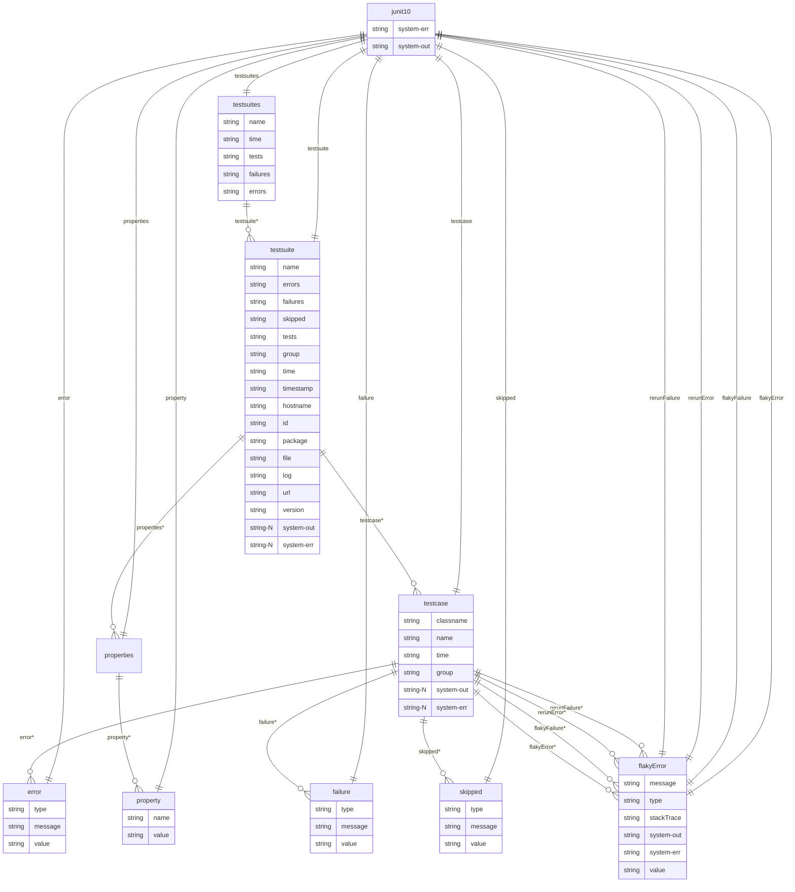

```mermaid
erDiagram
    junit10 ||--|| error : "error"
    junit10 ||--|| failure : "failure"
    junit10 ||--|| flakyError : "flakyError"
    junit10 ||--|| flakyError : "flakyFailure"
    junit10 ||--|| properties : "properties"
    junit10 ||--|| property : "property"
    junit10 ||--|| flakyError : "rerunError"
    junit10 ||--|| flakyError : "rerunFailure"
    junit10 ||--|| skipped : "skipped"
    junit10 ||--|| testcase : "testcase"
    junit10 ||--|| testsuite : "testsuite"
    junit10 ||--|| testsuites : "testsuites"
    junit10 {
        string system-err
        string system-out
    }
    testsuites ||--o{ testsuite : "testsuite*"
    testsuites {
        string name
        string time
        string tests
        string failures
        string errors
    }
    testsuite ||--o{ properties : "properties*"
    testsuite ||--o{ testcase : "testcase*"
    testsuite {
        string name
        string errors
        string failures
        string skipped
        string tests
        string group
        string time
        string timestamp
        string hostname
        string id
        string package
        string file
        string log
        string url
        string version
        string-N system-out
        string-N system-err
    }
    testcase ||--o{ skipped : "skipped*"
    testcase ||--o{ error : "error*"
    testcase ||--o{ failure : "failure*"
    testcase ||--o{ flakyError : "rerunFailure*"
    testcase ||--o{ flakyError : "rerunError*"
    testcase ||--o{ flakyError : "flakyFailure*"
    testcase ||--o{ flakyError : "flakyError*"
    testcase {
        string classname
        string name
        string time
        string group
        string-N system-out
        string-N system-err
    }
    properties ||--o{ property : "property*"
    properties {
    }
    skipped {
        string type
        string message
        string value
    }
    flakyError {
        string message
        string type
        string stackTrace
        string system-out
        string system-err
        string value
    }
    property {
        string name
        string value
    }
    failure {
        string type
        string message
        string value
    }
    error {
        string type
        string message
        string value
    }
```