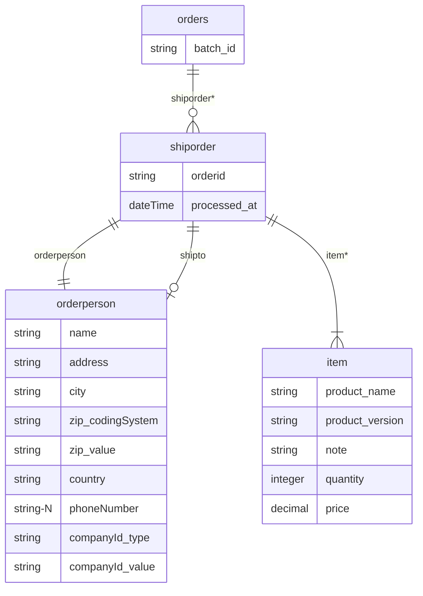

```mermaid
erDiagram
    orders ||--o{ shiporder : "shiporder*"
    orders {
        string batch_id
    }
    shiporder ||--|| orderperson : "orderperson"
    shiporder ||--o| orderperson : "shipto"
    shiporder ||--|{ item : "item*"
    shiporder {
        string orderid
        dateTime processed_at
    }
    item {
        string product_name
        string product_version
        string note
        integer quantity
        decimal price
    }
    orderperson {
        string name
        string address
        string city
        string zip_codingSystem
        string zip_value
        string country
        string-N phoneNumber
        string companyId_type
        string companyId_value
    }
```