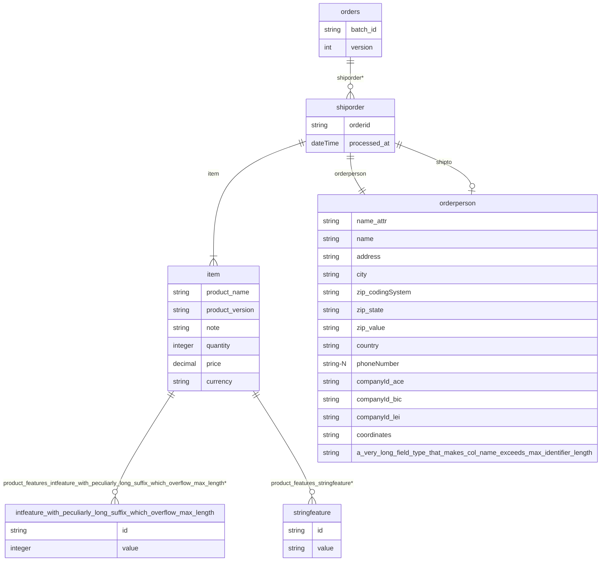

```mermaid
erDiagram
    item ||--o{ intfeature_with_peculiarly_long_suffix_which_overflow_max_length : "product_features_intfeature_with_peculiarly_long_suffix_which_overflow_max_length*"
    item ||--o{ stringfeature : "product_features_stringfeature*"
    item {
        string product_name
        string product_version
        string note
        integer quantity
        decimal price
        string currency
    }
    orders ||--o{ shiporder : "shiporder*"
    orders {
        string batch_id
        int version
    }
    shiporder ||--|| orderperson : "orderperson"
    shiporder ||--o| orderperson : "shipto"
    shiporder ||--|{ item : "item"
    shiporder {
        string orderid
        dateTime processed_at
    }
    stringfeature {
        string id
        string value
    }
    intfeature_with_peculiarly_long_suffix_which_overflow_max_length {
        string id
        integer value
    }
    orderperson {
        string name_attr
        string name
        string address
        string city
        string zip_codingSystem
        string zip_state
        string zip_value
        string country
        string-N phoneNumber
        string companyId_ace
        string companyId_bic
        string companyId_lei
        string coordinates
        string a_very_long_field_type_that_makes_col_name_exceeds_max_identifier_length
    }
```