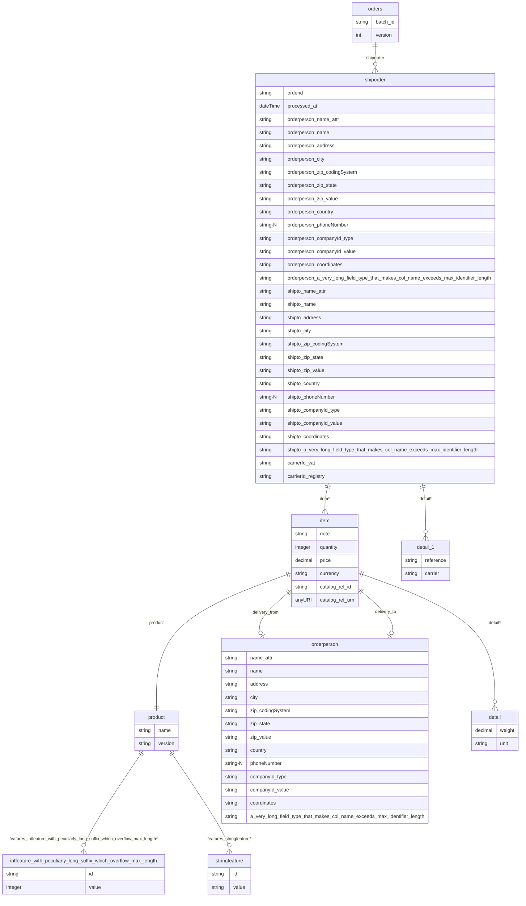

```mermaid
erDiagram
    shiporder ||--|{ item : "item*"
    shiporder ||--o{ detail_1 : "detail*"
    shiporder {
        string orderid
        dateTime processed_at
        string orderperson_name_attr
        string orderperson_name
        string orderperson_address
        string orderperson_city
        string orderperson_zip_codingSystem
        string orderperson_zip_state
        string orderperson_zip_value
        string orderperson_country
        string-N orderperson_phoneNumber
        string orderperson_companyId_type
        string orderperson_companyId_value
        string orderperson_coordinates
        string orderperson_a_very_long_field_type_that_makes_col_name_exceeds_max_identifier_length
        string shipto_name_attr
        string shipto_name
        string shipto_address
        string shipto_city
        string shipto_zip_codingSystem
        string shipto_zip_state
        string shipto_zip_value
        string shipto_country
        string-N shipto_phoneNumber
        string shipto_companyId_type
        string shipto_companyId_value
        string shipto_coordinates
        string shipto_a_very_long_field_type_that_makes_col_name_exceeds_max_identifier_length
        string carrierId_vat
        string carrierId_registry
    }
    item ||--|| product : "product"
    item ||--o| orderperson : "delivery_from"
    item ||--o| orderperson : "delivery_to"
    item ||--o{ detail : "detail*"
    item {
        string note
        integer quantity
        decimal price
        string currency
        string catalog_ref_id
        anyURI catalog_ref_urn
    }
    product ||--o{ intfeature_with_peculiarly_long_suffix_which_overflow_max_length : "features_intfeature_with_peculiarly_long_suffix_which_overflow_max_length*"
    product ||--o{ stringfeature : "features_stringfeature*"
    product {
        string name
        string version
    }
    stringfeature {
        string id
        string value
    }
    intfeature_with_peculiarly_long_suffix_which_overflow_max_length {
        string id
        integer value
    }
    detail {
        decimal weight
        string unit
    }
    orderperson {
        string name_attr
        string name
        string address
        string city
        string zip_codingSystem
        string zip_state
        string zip_value
        string country
        string-N phoneNumber
        string companyId_type
        string companyId_value
        string coordinates
        string a_very_long_field_type_that_makes_col_name_exceeds_max_identifier_length
    }
    detail_1 {
        string reference
        string carrier
    }
    orders ||--o{ shiporder : "shiporder"
    orders {
        string batch_id
        int version
    }
```