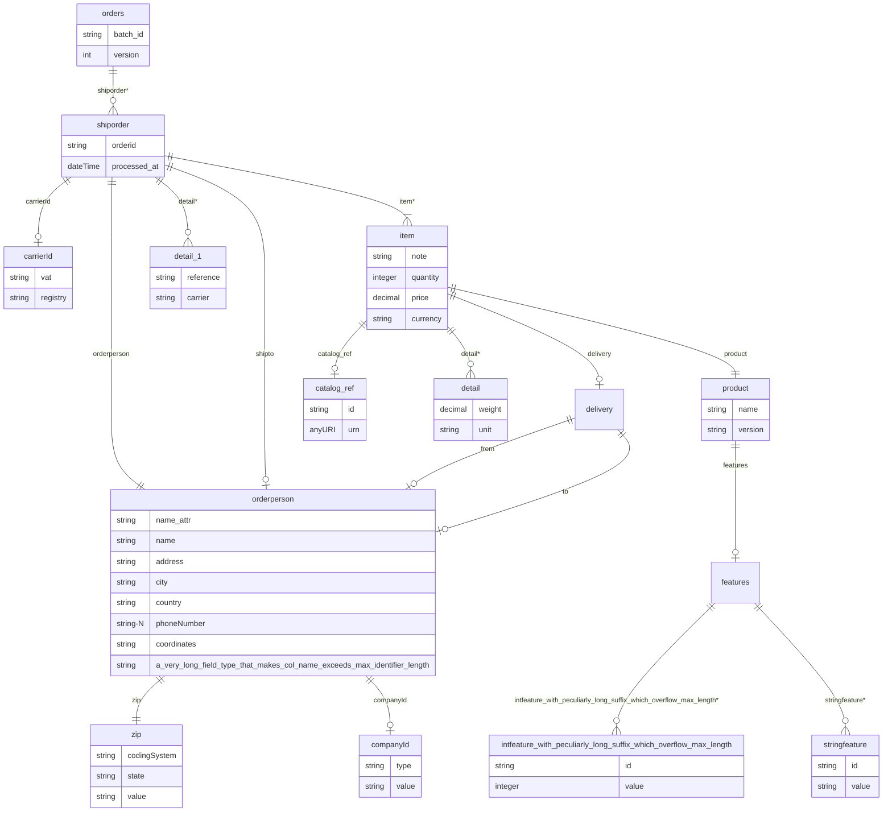

```mermaid
erDiagram
    orders ||--o{ shiporder : "shiporder*"
    orders {
        string batch_id
        int version
    }
    shiporder ||--|| orderperson : "orderperson"
    shiporder ||--o| orderperson : "shipto"
    shiporder ||--o| carrierId : "carrierId"
    shiporder ||--|{ item : "item*"
    shiporder ||--o{ detail_1 : "detail*"
    shiporder {
        string orderid
        dateTime processed_at
    }
    item ||--|| product : "product"
    item ||--o| delivery : "delivery"
    item ||--o| catalog_ref : "catalog_ref"
    item ||--o{ detail : "detail*"
    item {
        string note
        integer quantity
        decimal price
        string currency
    }
    product ||--o| features : "features"
    product {
        string name
        string version
    }
    delivery ||--o| orderperson : "from"
    delivery ||--o| orderperson : "to"
    delivery {
    }
    features ||--o{ intfeature_with_peculiarly_long_suffix_which_overflow_max_length : "intfeature_with_peculiarly_long_suffix_which_overflow_max_length*"
    features ||--o{ stringfeature : "stringfeature*"
    features {
    }
    orderperson ||--|| zip : "zip"
    orderperson ||--o| companyId : "companyId"
    orderperson {
        string name_attr
        string name
        string address
        string city
        string country
        string-N phoneNumber
        string coordinates
        string a_very_long_field_type_that_makes_col_name_exceeds_max_identifier_length
    }
    stringfeature {
        string id
        string value
    }
    intfeature_with_peculiarly_long_suffix_which_overflow_max_length {
        string id
        integer value
    }
    detail {
        decimal weight
        string unit
    }
    catalog_ref {
        string id
        anyURI urn
    }
    companyId {
        string type
        string value
    }
    zip {
        string codingSystem
        string state
        string value
    }
    detail_1 {
        string reference
        string carrier
    }
    carrierId {
        string vat
        string registry
    }
```