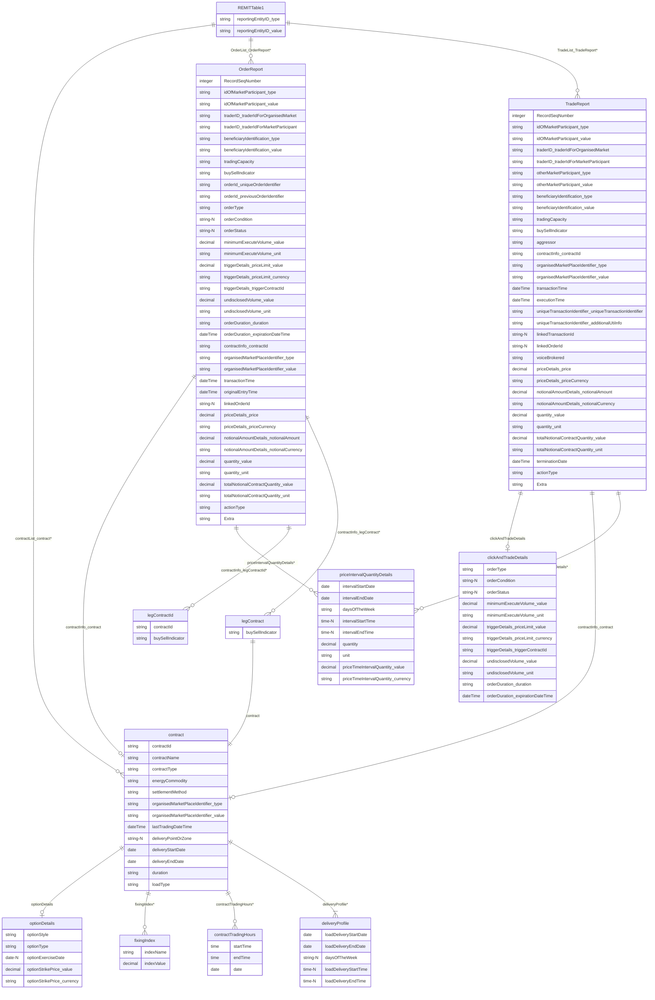

```mermaid
erDiagram
    REMITTable1 ||--o{ contract : "contractList_contract*"
    REMITTable1 ||--o{ OrderReport : "OrderList_OrderReport*"
    REMITTable1 ||--o{ TradeReport : "TradeList_TradeReport*"
    REMITTable1 {
        string reportingEntityID_type
        string reportingEntityID_value
    }
    OrderReport ||--o| contract : "contractInfo_contract"
    OrderReport ||--o{ priceIntervalQuantityDetails : "priceIntervalQuantityDetails*"
    OrderReport ||--o{ legContractId : "contractInfo_legContractId*"
    OrderReport ||--o{ legContract : "contractInfo_legContract*"
    OrderReport {
        integer RecordSeqNumber
        string idOfMarketParticipant_type
        string idOfMarketParticipant_value
        string traderID_traderIdForOrganisedMarket
        string traderID_traderIdForMarketParticipant
        string beneficiaryIdentification_type
        string beneficiaryIdentification_value
        string tradingCapacity
        string buySellIndicator
        string orderId_uniqueOrderIdentifier
        string orderId_previousOrderIdentifier
        string orderType
        string-N orderCondition
        string-N orderStatus
        decimal minimumExecuteVolume_value
        string minimumExecuteVolume_unit
        decimal triggerDetails_priceLimit_value
        string triggerDetails_priceLimit_currency
        string triggerDetails_triggerContractId
        decimal undisclosedVolume_value
        string undisclosedVolume_unit
        string orderDuration_duration
        dateTime orderDuration_expirationDateTime
        string contractInfo_contractId
        string organisedMarketPlaceIdentifier_type
        string organisedMarketPlaceIdentifier_value
        dateTime transactionTime
        dateTime originalEntryTime
        string-N linkedOrderId
        decimal priceDetails_price
        string priceDetails_priceCurrency
        decimal notionalAmountDetails_notionalAmount
        string notionalAmountDetails_notionalCurrency
        decimal quantity_value
        string quantity_unit
        decimal totalNotionalContractQuantity_value
        string totalNotionalContractQuantity_unit
        string actionType
        string Extra
    }
    TradeReport ||--o| clickAndTradeDetails : "clickAndTradeDetails"
    TradeReport ||--o| contract : "contractInfo_contract"
    TradeReport ||--o{ priceIntervalQuantityDetails : "priceIntervalQuantityDetails*"
    TradeReport {
        integer RecordSeqNumber
        string idOfMarketParticipant_type
        string idOfMarketParticipant_value
        string traderID_traderIdForOrganisedMarket
        string traderID_traderIdForMarketParticipant
        string otherMarketParticipant_type
        string otherMarketParticipant_value
        string beneficiaryIdentification_type
        string beneficiaryIdentification_value
        string tradingCapacity
        string buySellIndicator
        string aggressor
        string contractInfo_contractId
        string organisedMarketPlaceIdentifier_type
        string organisedMarketPlaceIdentifier_value
        dateTime transactionTime
        dateTime executionTime
        string uniqueTransactionIdentifier_uniqueTransactionIdentifier
        string uniqueTransactionIdentifier_additionalUtiInfo
        string-N linkedTransactionId
        string-N linkedOrderId
        string voiceBrokered
        decimal priceDetails_price
        string priceDetails_priceCurrency
        decimal notionalAmountDetails_notionalAmount
        string notionalAmountDetails_notionalCurrency
        decimal quantity_value
        string quantity_unit
        decimal totalNotionalContractQuantity_value
        string totalNotionalContractQuantity_unit
        dateTime terminationDate
        string actionType
        string Extra
    }
    legContract ||--|| contract : "contract"
    legContract {
        string buySellIndicator
    }
    contract ||--o| optionDetails : "optionDetails"
    contract ||--o{ fixingIndex : "fixingIndex*"
    contract ||--o{ contractTradingHours : "contractTradingHours*"
    contract ||--|{ deliveryProfile : "deliveryProfile*"
    contract {
        string contractId
        string contractName
        string contractType
        string energyCommodity
        string settlementMethod
        string organisedMarketPlaceIdentifier_type
        string organisedMarketPlaceIdentifier_value
        dateTime lastTradingDateTime
        string-N deliveryPointOrZone
        date deliveryStartDate
        date deliveryEndDate
        string duration
        string loadType
    }
    clickAndTradeDetails {
        string orderType
        string-N orderCondition
        string-N orderStatus
        decimal minimumExecuteVolume_value
        string minimumExecuteVolume_unit
        decimal triggerDetails_priceLimit_value
        string triggerDetails_priceLimit_currency
        string triggerDetails_triggerContractId
        decimal undisclosedVolume_value
        string undisclosedVolume_unit
        string orderDuration_duration
        dateTime orderDuration_expirationDateTime
    }
    priceIntervalQuantityDetails {
        date intervalStartDate
        date intervalEndDate
        string daysOfTheWeek
        time-N intervalStartTime
        time-N intervalEndTime
        decimal quantity
        string unit
        decimal priceTimeIntervalQuantity_value
        string priceTimeIntervalQuantity_currency
    }
    legContractId {
        string contractId
        string buySellIndicator
    }
    optionDetails {
        string optionStyle
        string optionType
        date-N optionExerciseDate
        decimal optionStrikePrice_value
        string optionStrikePrice_currency
    }
    fixingIndex {
        string indexName
        decimal indexValue
    }
    deliveryProfile {
        date loadDeliveryStartDate
        date loadDeliveryEndDate
        string-N daysOfTheWeek
        time-N loadDeliveryStartTime
        time-N loadDeliveryEndTime
    }
    contractTradingHours {
        time startTime
        time endTime
        date date
    }
```